# RabbitMQ

## 一、主流消息中间件介绍
### 1、ActiveMQ
#### ActiveMQ是Apache出品，最流行的，能力强劲的开源消息总线，并且它是一个完全支持JMS（Java Message Server）规范的消息中间件。
#### 其丰富的API、多种集群构建模式使得他成为业界老牌消息中间件，在中小型企业中应用广泛！
#### MQ衡量指标： 服务性能、数据存储、集群架构

    服务性能：服务性能不是特别好，面对超大规模的并发，会出现阻塞、消息堆积过多、产生延迟等等问题
    数据存储：
    
* 集群架构：Master-Slave模式、NetWork模式
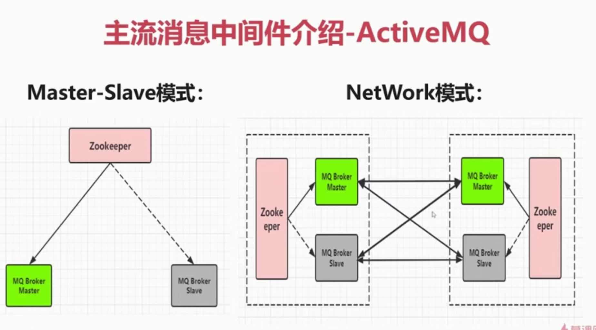

### 2、KAFKA
#### Kafka是Linkedln开源的分布式发布-订阅消息系统，目前属于Apache顶级项目，Kafka主要特点是基于Pull的模式来处理消息消费，追求高吞吐量，一开始的目的就是用于日志收集和传输。0.8版本开始支持复制，不支持事务，对消息的重复、丢失、错误没有严格要求，适合产生大量数据的互联网服务的数据收集业务。

    一开始设计是针对大数据的
    
* 集群架构：
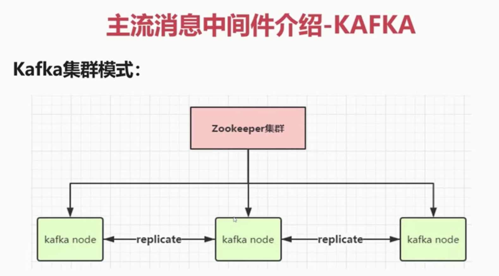

### 3、RocketMQ
#### RocketMQ是阿里开源的消息中间件，目前也是已经孵化为Apache顶级项目，它是纯Java开发，具有高吞吐量、高可用性、适合大规模分布式系统应用的特点。RocketMQ思路起源于Kafka，它对消息的可靠传输及事务性做了优化，目前在阿里集团被管饭应用于交易、充值、流计算、消息推送、日志流式处理、binglog分发等场景

    特点：可以保障消息的顺序性（顺序消费）、有丰富的消息拉取和处理的模式、也可以进行高效的订阅者，进行水平扩展实时消息队列机制、能承载上亿级别的消息堆积能力
    
* 集群架构：Master-Slave模式...

### 4、RabbitMQ
#### RabbitMQ是使用Erlang语言开发的开源消息队列系统，基于AMQP协议来实现。AMQP的主要特征是面向消息、队列、路由（包括点对点和发布/订阅）、可靠性、安全。AMQP协议更多用在企业系统内，对数据一致性、稳定性和可靠性要求很高的场景，对性能和吞吐量的要求还在其次。

* 集群架构：

## 二、RabbitMQ核心概念及AMQP协议

#### RabbitMQ是一个开源的消息代理和队列服务器，用来通过普通协议在完全不同的应用之间共享数据，RabbitMQ是使用Erlang语言来编写的，并且RabbitMQ是基于AMQP协议的

### 1、互联网大厂为什么选择RabbitMQ？
* 滴滴、美团、头条、去哪儿、艺龙...
* 开源、性能优秀、稳定性保障
* 提供可靠性消息投递模式（confirm）、返回模式（return）
* 与Spring AMQP完美的整合
* 集群模式丰富，表达式配置，HA模式，镜像队列模型
* 保证数据不丢失的前提做到高可靠性、可用性

### 2、RabbitMQ的高性能之道是如何做到的？
* Erlang语言最初用于交换机领域的架构模式，这样使得RabbitMQ在Broker 之间进行数据交互的性能是非常优秀的
* Erlang的有点：Erlang有着和原生Socket一样的延迟

### 3、什么是AMQP高级消息队列协议？
* AMQP全称：Advanced Message Queuing Protocol
* AMQP翻译：高级消息队列协议
* AMQP定义：是具有现代特征的二进制协议。是一个提供统一消息服务的应用层标准高级消息队列协议，是应用层协议的一个开放标准，为面向消息的中间件设计
#### AMQP协议模型
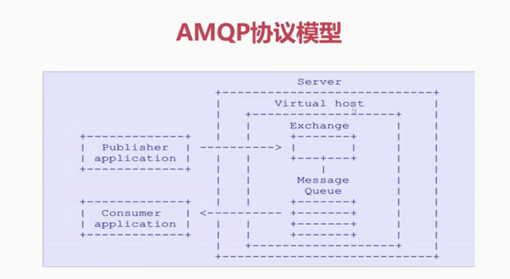

### 4、AMQP核心概念是什么？
#### （1）、Server：又称Broker（MQ服务器一般都叫Broker），接受客户端的连接，实现AMQP实例服务
#### （2）、Connection：连接，应用程序与Broker的网络连接
#### （3）、Channel：网络通道，几乎所有的操作（数据读写等等）都在Channel中进行，Channel是进行消息读写的通道。客户端可建立多个Channel，每个Channel代表一个会话任务
#### （4）、Message：消息，服务器和应用程序之间传送的数据，由Properties和Body组成。Properties可以对消息进行修饰，比如消息的优先级、延迟等高级特性；Body则就是消息体内容
#### （5）、Virtual host：虚拟地址，用于进行逻辑隔离，最上层的消息路由。一个Virtual Host里面可以有若干个Exchange和Queue，同一个VirtualHost里面不能有相同名称的Exchange或Queue
#### （6）、Exchange：交换机，接收消息，根据路由键转发消息到绑定的队列（生产者直接把消息投递到Exchange上，通过Exchange去进行路由，路由到指定的队列，队列和Exchange有一个绑定的关系）
#### （7）、Binging：Exchange和Queue之间的虚拟连接，binding中可以包含routing key
#### （8）、Routing key：一个路由规则，虚拟机可用它来确定如何路由一个特定消息
#### （9）、Queue：也称为Message Queue，消息队列，保存消息并将它们转发给消费者

### 5、RabbitMQ整体架构模型是什么样子的？
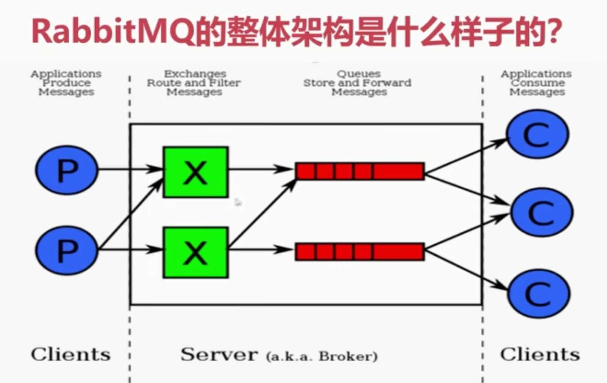
### 6、RabbitMQ消息是如何流转的的？
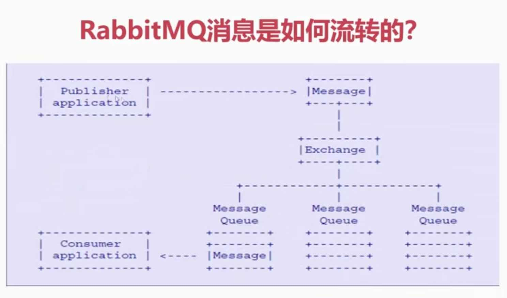
### 7、RabbitMQ安装与使用
    官网地址：http://www.rabbitmq.com
    提前准备：安装Linux必要安装包
    下载RabbitMQ必须安装包
    配置文件修改
    
    准备：
    yum install build-essential openssl openssl-devel unixODBC unixODBC-devel make gcc gcc-c++ kernel-devel m4 ncurses-devel tk tc xz
    
    下载：
    wget www.rabbitmq.com/releases/erlang/erlang-18.3-1.el7.centos.x86_64.rpm
    wget http://repo.iotti.biz/CentOS/7/x86_64/socat-1.7.3.2-5.el7.lux.x86_64.rpm
    wget www.rabbitmq.com/releases/rabbitmq-server/v3.6.5/rabbitmq-server-3.6.5-1.noarch.rpm
    
    安装：(这个过程可能需要升级glibc-2.17，参考这个连接https://cloud.tencent.com/developer/article/1463094)
    rpm -ivh erlang-18.3-1.el7.centos.x86_64.rpm
    rpm -ivh socat-1.7.3.2-1.1.el7.x86_64.rpm
    rpm -ivh rabbitmq-server-3.6.5-1.noarch.rpm
    
    配置文件：
    vim /usr/lib/rabbitmq/lib/rabbitmq_server-3.6.5/ebin/rabbit.app
    比如修改密码、配置等等，例如：loopback_users 中的 <<"guest">>,只保留guest
    服务启动和停止：
    启动 rabbitmq-server start &
    停止 rabbitmqctl app_stop
    
    管理插件：rabbitmq-plugins enable rabbitmq_management6
    访问地址：http://192.168.11.76:15672/

#### （1）、默认端口号：5672
* 这个端口号是通信的端口号，也就是说这是Java端通信的端口号
* 15672：管控台的端口号
* 25672：集群进行通信的端口号
#### （2）、服务的启动：rabbitmq-server start &
    & 表示后台启动
    vim /etc/hostname 修改主机名
    lsof -i:5672    // 通过端口号查看服务是否启动
        如果可以看到beam.smp 9599 rabbitmq   52u  IPv6 223762147      0t0  TCP *:amqp (LISTEN)，就证明RabbitMQ可以了
    
#### （3）、服务的停止：rabbitmqctl app_stop
#### （4）、管理插件：rabbitmq-plugins enable rabbitmq_management
    rabbitmq-plugins list   查看所有插件
    rabbitmq-plugins enable rabbitmq_management   安装管控台
* 管控台默认的端口号是：15672
#### （5）、访问地址：http://XXX:15672/

### 8、命令行与管控台
#### （1）、基础操作
* rabbitmqctl stop_app：关闭应用
* rabbitmqctl start_app：启动应用
* rabbitmqctl status：节点状态
* rabbitmqctl add_user username password：添加用户
* rabbitmqctl list_users：列出所有用户
* rabbitmqctl delete_user username：删除用户
* rabbitmqctl clear_permissions -p vhostpath username：清除用户权限
* rabbitmqctl list_user_permissions username：列出用户权限
* rabbitmqctl change_password username newpassword：修改密码
* rabbitmqctl set_permissions -p vhostpath username ".*" ".*" ".*"：设置用户权限
* rabbitmqctl add_vhost vhostpath：创建虚拟主机
* rabbitmqctl list_vhosts：列出所有虚拟主机
* rabbitmqctl list_permissions -p vhostpath：列出虚拟主机上所有权限
* rabbitmqctl delete_vhost vhostpath：删除虚拟主机
* rabbitmqctl list_queues： 查看所有队列信息
* rabbitmqctl -p vhostpath purge_queue blue：清除队列里的消息

#### （2）、高级操作 （侧重集群运维）
* rabbitmqctl reset：移除所有数据，要在rabbitmqctl stop_app之后使用
* rabbitmqctl join_cluster <clusternode> [--ram]：组成集群命令
* rabbitmqctl cluster_status：查看集群状态
* rabbitmqctl change_clster_node_type disc | ram：修改集群节点的存储形式
* rabbitmqctl forget_cluster_node [--offline] 忘记节点（摘除节点）
* rabbitmqctl rename_cluster_node oldnode1 newnode1 [oldnode2] [newnode2 ...]：修改节点名称

#### （3）、控制台
#####  Overview 总览 
    Queued messages : 如果有消息消费（创建队列）这里就会有一个折线图
    Global counts :
        Connections : 有多少连接
        Channels    : 有多少通信信道
        Exchanges   : 主机数
        Queues      : 队列数
        Consumers   : 消费者数
    Node : 节点的使用状态
    Paths : 配置文件，日志等数据的文件路径
        Config file : /etc/rabbitmq/rabbitmq.config (not found) 
            rpm 安装就没有这个文件    
            源码安装才会配置这个文件
            
    Ports and contexts : 端口
    
    Import / export definitions : 
        可以导入文件定义，可以导入导出RabbitMQ的配置，
        就比如 导出已经配置好的交换机、队列、绑定，然后在导入到新的环境中   
        
        
##### Connections 连接
##### Channels 网络通信的信道
    所有的应用服务和RabbitMQ进行连接都需要建立Channel来进行实际的操作
##### Exchange 交换机
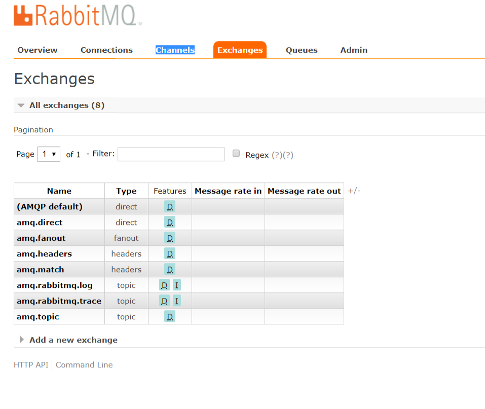

    生产者把消息默认投递到的位置
    默认提供的交换机都是以amq.开头的
    direct  直连的方式
    fanout  分发广播的方式
    headers 表示以头的形式
    topic   路由的方式 （重要）
    
    
    Durability 表示MQ是否持久化

### 9、RabbitMQ消息生产与消费
* ConnectionFactory : 获取链接工厂
* Connection : 一个连接
* Channel : 数据通信信道，可发送和接受消息
* Queue : 具体的消息存储队列
* Producer & Consumer 生产和消费者

### 10、RabbitMQ交换机详解
* Exchange : 接收消息，并根据路由键转发消息锁绑定的队列
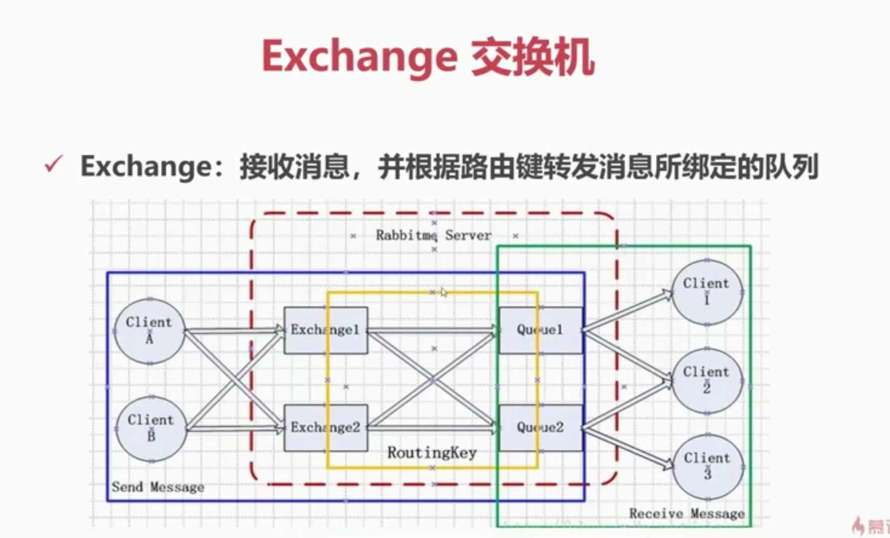
#### （1）、交换机属性
* Name : 交换机名称
* Type : 交换机类型 direct、topic、fanout、headers
* Durability : 是否需要持久化，true为持久化
* Auto Delete : 当最后一个绑定到Exchange上的队列删除后，自动删除该Exchange
* Internal : 当前Exchange是否用于RabbitMQ内部使用，默认为False
* Arguments : 扩展参数，用于扩展AMQP协议自制定化使用

#### （2）、Direct Exchange （直连）
* 所有发送到Direct Exchange 的消息被转发到RouteKey中指定的Queue

**注意：Direct模式可以使用RabbitMQ自带的Exchange：default Exchange，
所以不需要将Exchange进行任何绑定（binding）操作，消息传递时，
RouteKey必须完全匹配才会被队列接收，否则该消息会被抛弃**
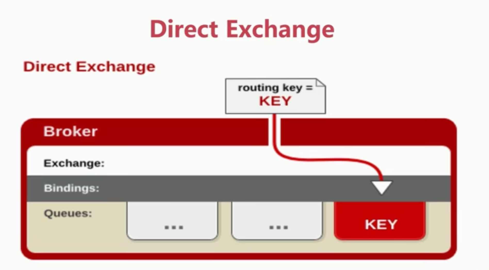

#### （3）、Topic Exchange
* 所有发送到Topic Exchange的消息被转发到所有关心RouteKey中指定Topic的Queue上
* Exchange 将RouteKey 和某Topic 进行模糊匹配，此时队列需要绑定一个Topic

**注意：可以使用通配符进行模糊匹配**
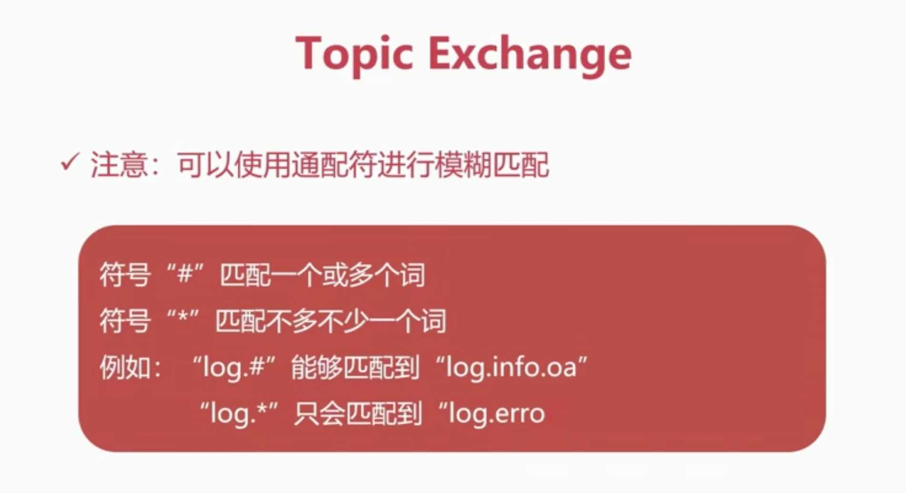

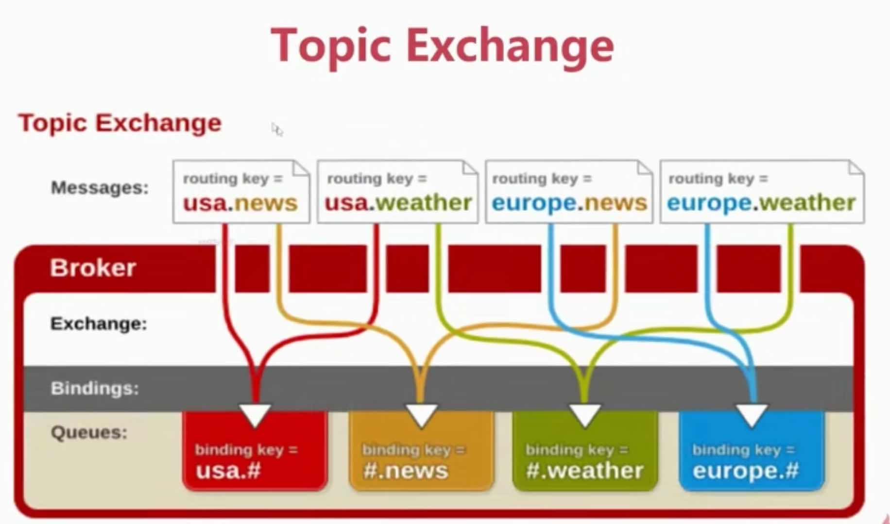

#### （4）、Fanout Exchange
* 不处理路由键，只需要简单的将队列绑定到交换机上
* 发送到交换机的消息都会被转发到与该交换机绑定的所有队列上
* Fanout交换机转发消息是最快的
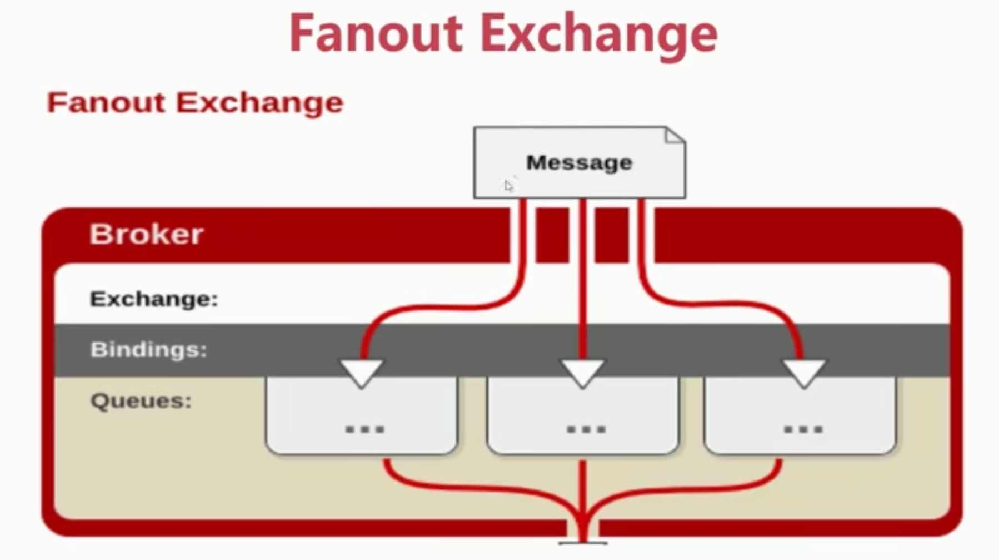

### 11、RabbitMQ队列、绑定、虚拟主机、消息

#### （1）、Binding - 绑定
* Exchange和Exchange、Queue之间的连接关系
* Binding中可以包含RoutingKey或者参数

#### （2）、Queue - 消息队列
* 消息队列，实际存储消息数据
* Durability：是否持久， Durable：是， Transient：否
* Auto delete：如选yes，代表当最后一个监听被移除之后，该Queue会自动被删除

#### （3）、Message - 消息
* 服务器和应用程序之间传送的数据
* 本质上就是一段数据，由Properties和Payload（Body）组成
* 常用属性：delivery mode、headers（自定义属性）
* content-type、content_encoding、priority
* correlation_id、reply_to、expiration、message_id
* timestamp、type、user_id、app_id、cluster_id

#### （4）、 Virtual host - 虚拟主机
* 虚拟地址，用于进行逻辑隔离，最上层的消息路由
* 一个Virtual Host里面可以有若干个Exchange和Queue
* 同一个Virtual Host里面不能有相同名称的Exchange或Queue

## 三、RabbitMQ高级特性

### 1、消息如何保障 100% 的投递成功？
#### （1）、什么是生产端的可靠性投递？
* 保障消息的成功发出
* 保障MQ节点的成功接收
* 发送端收到MQ节点（Broker）确认应答
* 完善的消息进行补偿机制

#### （2）、生产端 - 可靠性投递（一）
##### BAT/TMD 互联网大厂的解决方案
* 消息落库，对消息状态进行打标  --  发送了消息之后，要把消息存到库中，然后轮询接收消息的应答，然后对库中消息的状态进行更改

* 消息的延迟投递，做二次确认，回调检查

#### （3）、生产端 - 可靠性投递（二）
##### 消息信息落库，对消息状态进行打标
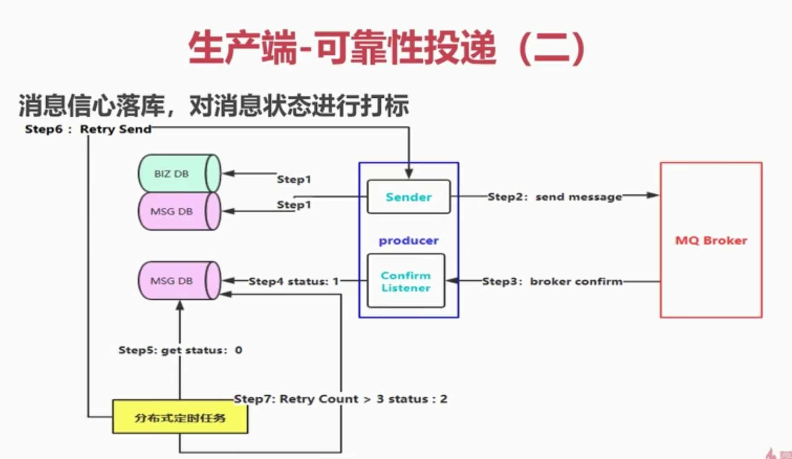
* Step1：首先将自己的业务入库，然后生产一条订单消息封装，然后将这条消息也入库，做一个后续的入库（这里有俩次写盘操作）
* Step2：把消息发送出去
* Step3：应答结果给生产端，生产端会异步的监听（Confirm Listener）MQ Broker 返回的应答结果
* Step4：然后我们再从数据库中把指定的消息记录抓取出来，然后更新这条消息的状态（这里假设状态：0为投递成功）
* Step5：通过定时任务来抓取这条状态为0的消息数据，每隔多少时间去查询一次 （这里就会用到分布式定时任务）
* Step6：如果超过了最大限制时间还没有抓取到这条消息，那么就重试，重新生成消息封装，重头来
* Step7：但是如果多次重来还是不成功，这里需要限制重试的次数，这里可以通过人工补偿查询失败的原因

#### （4）、生产端 - 可靠性投递（三）
##### 保障MQ我们思考如果第一种可靠性投递，在高并发的场景下是否适合？
##### 消息的延迟投递，做二次确认，回调检查 （这么做少做了一次DB存储，这个目的是保证性能）

* Step1：先把业务消息进行数据库落库，然后在去发送消息到MQ服务（这里一定是先持久化业务消息，再去发送MQ消息）
* Step2：在发送第一条消息之后（这条消息投递到真正处理业务所对应的队列中），然后再发第二条消息（这条消息投递到Callback服务所对应的业务，也就是延迟投递的消息），假设5分钟之后发送第二条
* Step3：Broker端收到消息，然后监听Consumer处理消息，等待应答结果
* Step4：Consumer处理完成之后会发送一个confirm的响应（注意：这里也是一个新的消息，这里的消息的内容就是表明业务消息成功被消费，并不是正常的那个ACK），发送给MQ
* Step5：消费端把消息处理成功之后会生成一条新的消息（Send confirm）发送到MQServer，
然后由Callback服务去监听下游服务（真正 处理业务消息的那个服务）是否成功处理了业务消息，然后Callback就对这条消息进行入库处理
* Step6：延迟投递的消息（第二条消息）投递的队列是由Callback服务监听处理的，Callback服务通过获取到的第二条消息，
然后和自己数据库中的数据进行Check（这里就是延迟check）
* Step7：如果Callback此时Check结果无效，那么Callback会主动发起一个RPC通信（携带业务消息ID）给业务消息发起方，要求业务消息发起方从新发送一次业务消息

### 2、幂等性概念详情
#### 幂等性是什么？
* 我们可以借鉴数据库的乐观锁机制
* 比如我们执行一条更新库存的SQL语句
* UPDATE T_REPS SET COUNT = COUNT - 1, VERSION = VERSION + 1 WHERE VERSION = 1

### 3、在海量订单产生的业务高峰期，如何避免消息的重复消费问题？
#### 消费端 - 幂等性保障
##### 在海量订单产生的业务高峰期，如何避免消息的重复消费问题？
* 消费端实现幂等性，就意味着，我们的消息永远不会消费多次，即使我们收到了多条一样的消息

##### 业界主流的幂等性操作：
* 唯一ID + 指纹码 机制，利用数据库主键去重
* 利用Redis的原子性去实现

##### 唯一ID + 指纹码 机制
* 唯一ID + 指纹码 机制， 利用数据库主键去重
* SELECT COUNT(1) FROM T_ORDER WHERE ID = 唯一ID + 指纹码
* 好处：实现简单
* 坏处：高并发下有数据库写入的性能瓶颈
* 解决方案：根进ID进行分库分表进行算法路由

##### 利用Redis原子特性实现
* 使用Redis进行幂等，需要考虑的问题
* 第一：我们是否要进行数据落库，如果落库的话，关键解决的问题是数据库和缓存如何做到原子性？
* 第二：如果不进行落库，那么都存储到缓存中，如何设置定时同步的策略？

### 4、Confirm确认消息、Return返回消息   ----   投递消息的机制（都是针对生产端的）
#### （1）、Confirm确认消息
##### 理解Confirm消息确认机制：
* 消息的确认是指生产者投递消息后，如果Broker收到消息，则会给我们生产者一个应答。
* 生产者进行接收应答，用来确认这条消息是否正常的发送到Broker，这种方式也是消息的可靠性投递的核心保障！

##### 如何实现Confirm确认消息？
* 第一步：在Channel上开启确认模式：channel.confirmSelect()
* 第二部：在Channel上添加监听：addConfirmListener，监听成功和失败的返回结果，根据具体的结果对消息进行重新发送、或记录日志等后续处理！

#### （2）、Return消息机制
* Return Listener 用于处理一些不可路由的消息！
* 我们的消息生产，通过制定一个Exchange 和 RoutingKey，把消息送达到某一个队列中去，然后我们的消费者监听队列，进行消费处理操作！
* 但是在某些情况下，如果我们在发送消息的时候，当前的Exchange不存在或者指定的路由Key路由不到，这个时候如果我们需要监听这种不可达的消息，就要是用Return Listener
##### Return消息机制
* 在基础API中有一个关键的配置项：
* Mandatory：如果为true，则监听器会接收到路由不可达的消息，然后进行后续处理，如果为false，那么broker端自动删除该消息

##### Return消息机制流程
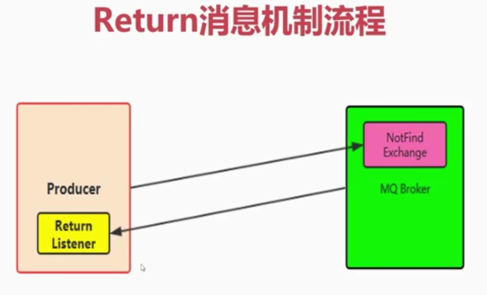

### 5、自定义消费者
#### （1）、消费端自定义监听
* 我们一般就是在代码中编写While循环，进行consumer.nextDelivery方法进行获取下一条消息，然后进行消费处理！
* 但是我们使用自定义的Consumer更加的方便，解耦性更加的强，也是在实际工作中最常用的使用方式！

### 6、消息的限流 
#### （1）、什么是消费端的限流？
* 假设一个场景，首先，我们RabbitMQ服务器有上万条未处理的消息，我们随便打开一个消费者客户端，会出现下面情况
* 巨量的消息瞬间全部推送过来，但是我们单个客户端无法同时处理这么多数据！
* RabbitMQ提供了一种qos（服务质量保证）功能，即在非自动确认消息的前提下，如果一定数目的消息（通过基于consumer或者channel设置Qos的值）未被确认前，不进行消费新的消息
* void basicQos(int prefetchSize, int prefetchCount, boolean global) throws IOException; （在消费端处理）
* prefetchSize：0   消息的大小限制，为0就是不限制
* prefetchCount：会告诉RabbitMQ不要同时给一个消费者推送多于N个消息，即一旦有N个消息还没有ack，则该consumer将block掉，直到有消息ack
* global：true\false 是否将上面设置应用于Channel简单点说，就是上面限制是channel级别的还是consumer级别的
* prefetchSize 和 global 这两项，rabbitmq没有实现， 暂且不研究prefetch_count在no_ask=false的情况下生效，

    channel.basicConsume(queueName, true, consumer);
    String basicConsume(String queue, boolean autoAck, Consumer callback) throws IOException;
    在RabbitMQ中签收的方式有俩种：自动签收，手动签收
    autoAck： 在真正的工作中，如果需要限流，那么就不能做自动的签收

### 6、消息的ACK与重回队列
#### 消费端的手工ACK和NACK
* 消息端进行消费的时候，如果由于业务异常我们可以进行日志的记录，然后进行补偿！
* 如果由于服务器宕机等严重问题，那么我们就需要手工进行ACK保障消费端消费成功

#### 消费端的重回队列
* 消费端重回队列是为了对没有处理成功的消息，把消息重新会递给Broker
* 一般我们在实际应用中，都会关闭重回队列，也就是设置为False

### 8、TTL消息
#### TTL
* TTL是Time To Live 的缩写，也就是生存时间
* RabbitMQ支持消息的过期时间，在消息发送时可以进行制指定
* RabbitMQ支持队列的过期时间，从消息入队列开始计算，只要超过了队列的超时时间配置，那么消息会自动的清除

### 9、死信队列
#### 死信队列： DLX， Dead-Letter-Exchange
* 利用DLX，当消息在一个队列中变成死信（dead message， 没有任何消费者来消费它）之后，它能被重新publish到另一个Exchange，这个Exchange就是DLX

#### 消息变成死信有以下几种情况
* 消息被拒绝(basic.reject/basic.nack)并且request = false
* 消息TTL过期
* 队列达到最大的长度

#### 死信队列
* DLX也是一个正常的Exchange， 和一般的Exchange没有区别，它能在任何队列上被指定，实际上就是设置某个队列的属性
* 当这个队列中有死信时，RabbitMQ就会自动的将这个消息重新发布到设置的Exchange上去，进而被路由到另一个队列。
* 可以监听这个队列中消息做响应的处理，这个热性可以弥补rabbitMQ3.0以前支持的immediate参数的功能

#### 死信队列设置
* 首先需要设置死信队列的exchange和queue，然后进行绑定

    例如
    Exchange: dlx.exchange
    Queue: del.queue
    RoutingKey: #
    
* 然后我们进行正常声明交换机、队列、绑定，只不过我们需要在队列加上一个参数即可：arguments.put("x-dead-letter-exchange", "dlx.exchange");

* 这样消息在过期、requeue、队列在达到最大长度时，消息就可以直接路由到死信队列
    
    

## 四、RabbitMQ高级整合应用

### 1、RabbitMQ整合Spring AMQP实战

#### （1）、RabbitAdmin
* RabbitAdmin类可以很好的操作RabbitMQ，在Spring中直接进行注入即可
* 注意：autoStartup必须要设置为true，否则Spring容器不会加载RabbitAdmin类
* RabbitAdmin底层实现就是从Spring容器中获取Exchange，Binging、RoutingKey以及Queue的@Bean声明
* 然后使用RabbitTemplate的execute方法执行对应的声明、修改、删除等一系列RabbitMQ基础功能操作
* 例如：添加一个交换机、删除一个绑定、清空一个队列里的消息等等

#### （2）、SpringAMQP 声明
* 在Rabbit基础API里面声明一个Exchange、声明一个绑定、一个队列

    channel.exchangeDeclare(exchangeName, "topic", true, false, null);
    channel.queueDeclare(queueName, true, false, false, null);
    channel.queueBind(queueName, exchangeName, routingKey);

* 使用SpringAMQP去声明，就需要使用SpringAMQP的如下模式，即声明@Bean方式
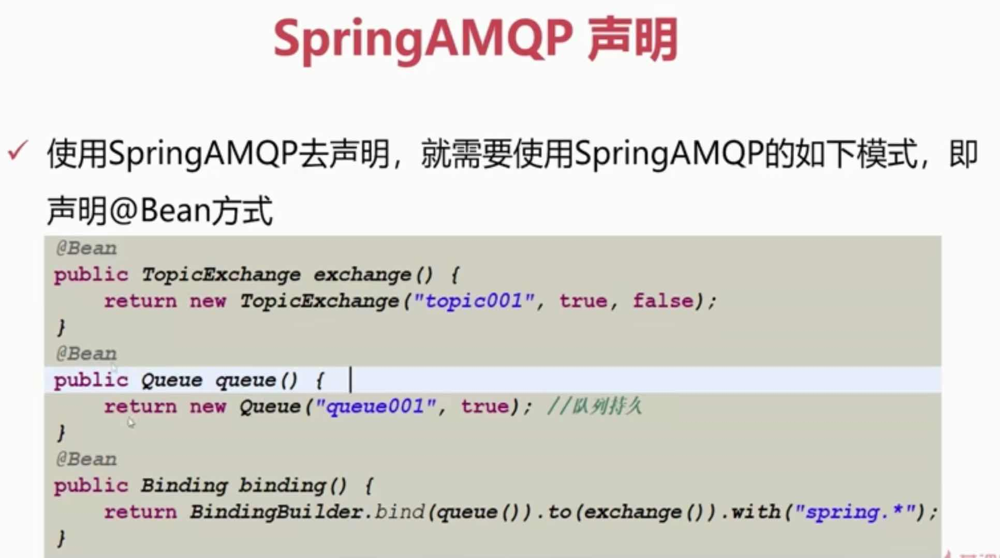

#### （3）、RabbitTemplate 消息模板
* 我们在与SpringAMQP整合的时候进行发送消息的关键类
* 该类提供了丰富的发送消息方法，包括可靠性投递消息方法、
回调监听消息接口ConfirmCallBack、
返回值确认接口ReturnCallBack等等。同样我们需要进行注入到Spring容器中，然后直接使用
* 在与Spring整合时需要实例化，但是在与SpringBoot整合时，在配置文件里添加配置即可

#### （4）、SimpleMessageListenerContainer 消息的消费者
##### 简单消息监听容器
* 这个类非常强大，我们可以对他进行很多设置，对于消费者的配置项，这个类都可以满足
* 监听队列（多个队列），自动启动，自动声明功能
* 设置事务特性、事务管理器、事务属性、事务容量（并发）、是否开启事务、回滚消息等
* 设置消费者数量、最大最小数量、批量消费
* 设置消息确认和自动确认模式、是否重回队列、异常捕获handler函数
* 设置消费者标签生成策略、是否独占模式、消费者属性等
* 设置具体的监听器、消息转换器等等
* 注意：SimpleMessageListenerContainer可以进行动态设置，比如在运行中的应用可以动态的修改其消费者数量的大小、接收消息的模式等
* 很多基于RabbitMQ的自制化后端管控台在进行动态设置的时候，也是根据这一特性去实现的，所以可以看出SpringAMQP非常的强大

##### SimpleMessageListenerContainer为什么可以动态感知配置变更？

#### （5）、MessageListenerAdapter
##### MessageListenerAdapter 即消息监听适配器
* 通过messageListenerAdapter的代码我们可以看出如下核心属性
* defaultListenerMethod默认监听方法名称：用于设置监听方法名称
* Delegate 委派对象：实际真实的委派对象，用于处理消息

##### MessageListenerAdapter 即消息监听适配器，这个是自定义的

* queueOrTagToMethodName 队列表示与方法名称组成的集合
* 可以一一进行队列与方法名称的匹配
* 队列和方法名称绑定，即指定队列里的消息会被绑定的方法所接受处理

     // 适配器方式，默认是有子弟的方法名字的，handleMessage
     // 可以自己制定一个方法的名字， consumerMessage
     // 也可以添加一个转换器，从字节数组转换为String
     MessageListenerAdapter adapter = new MessageListenerAdapter(new MessageDelegate());
     // 自定义adapter处理方法
     adapter.setDefaultListenerMethod("consumerMessage");
     // 添加Message转换器（自定义）
     adapter.setMessageConverter(new TextMessageConverter());
     // 设置适配器
     container.setMessageListener(adapter);

#### （6）、MessageConverter   
##### MessageConverter 消息转换器
* 我们在进行发送消息的时候，正常情况下消息体为二进制的数据方式进行传输，如果希望内部帮我们进行转换，或者指定自定义的转换器，就需要用到MessageConverter
* 自定义常用转换器： MessageConverter， 一般来讲都需要实现这个接口
* 重写下面两个方法：
    

    toMessage：java对象转换为Message
    fromMessage：Message对象转换为Java对象
    
* Json转换器：Jackson2JsonMessageConverter：可以进行java对象的转换功能
* DefaultJackson2JavaTypeMapper映射器：可以进行java对象的映射关系
* 自定义二进制转换器：比如图片类型、PDF、PPT、流媒体

### 2、RabbitMQ整合Spring Boot 实战
#### （1）、SpringBoot整合配置详解 生产者端核心配置
* publisher-confirms，实现一个监听器用于监听Broker端给我们返回的确认请求：RabbitTemplate.ConfirmCallback
* publisher-returns，保证消息对Broker端是可达的，如果出现路由键不可达的情况，则使用监听器对不可达的消息进行后续的处理，保证消息的路由成功：RabbitTemplate.ReturnCallback

* 注意一点，在发送消息的时候对template进行配置mandatory=true保证监听有效
* 生产端还可以配置其他属性，比如发送重试，超时时间、次数、间隔等

        spring.rabbitmq.addresses=183.2.169.17:5672
        spring.rabbitmq.username=guest
        spring.rabbitmq.password=guest
        spring.rabbitmq.virtual-host=/
        spring.rabbitmq.connection-timeout=15000
        
        spring.rabbitmq.publisher-confirms=true
        spring.rabbitmq.publisher-returns=true
        spring.rabbitmq.template.mandatory=true

#### （2）、消费端核心配置
* 首先配置手工确认模式，用于ACK的手工处理，这样我们可以保证消息的可靠性送达，
或者在消费端消费失败的时候可以做重回队列、根据业务记录日志等处理
* 可以设置消费端的监听个数和最大个数，用于控制消费端的并发情况

    spring.rabbitmq.listener.simple.acknowledge-mode=manual
    spring.rabbitmq.listener.simple.concurrency=1
    spring.rabbitmq.listener.simple.max-concurrency=5

##### @RabbitListener注解使用
* 消费端监听 @RabbitListener注解，这个对于在实际工作中非常好用
* @RabbitListener 是一个组合注解，里面可以注解配置
@queueBinding、@Queue，@Exchange直接通过这个组合注解一次性搞定消费端交换机、队列
绑定、路由、并且配置监听功能等

由于类配置写在代码里非常不友好，所以强烈建议大家使用配置文件配置。

### 3、RabbitMQ整合Spring Cloud实战

